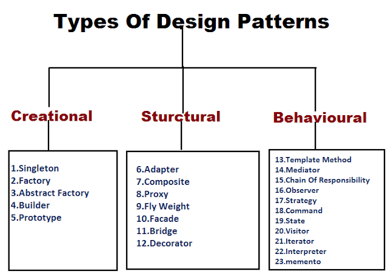

## Introduction

To me, the design of a program is one of the most interesting aspects of software engineering. There are dozens of ways to solve any particular problem, with one inevitably being the most efficient but not necessarily the most interesting. For example, when attempting to reorder an array, there are hundreds of sorting algorithms that someone can pick. Choosing the correct one for a specific situation would be an example of a software design decision that developers make on a daily basis.

## The Human Aspect

Knowing that these decisions are made and modified consistently is important. However, one must also  consider the human aspect of software engineering. It is a proven fact that humans are drawn to patterns. We even seek out patterns where they do not exist. It's the reason why we are still alive today - it was a trait that helped humans make a distinction betweeen things that will hurt or help us.

Knowing this about humans, it's only natural that there are certain patterns that spring up within software design. This is what is known as a software design pattern, and they are everywhere.

## Comfort in Repetition

There are three generally accepted types of software design patterns - creational, structural, and behavioral. They work how you'd think they would. 

Creational patterns are used when formulating objects from scratch. An example of this would be an abstract factory, which is generally used for creating families of objects.

Structural patterns refer to creating large structures from smaller existing parts from different classes. One of the most useful examples of this is the bridge, which is used to merge an interface and its implementation.

Behavioral patterns are what describe the relationship between objects. A heavily used example is an iterator, which can provide a sequential view of the indices of a collection object without actually having to worry about what that object is.

All of these patterns must be used together to create an efficient and effective program. They are used in a wide variety of cases, with many practical examples.

## The Real World

Within my own code, there are many software design patterns used. For example, within the group project I am developing in my software engineering class, many of these patterns are utilized within a particular area. I was responsible for much of the collection handling within the project.

Within the actual creation of the collections, a creational pattern called a prototype was used. This could have instead been a typical class instance way of creating the collection, but prototypes tend to save a lot of the computational cost associated with object creation. In the WriteReview file, which uses a schema to assign values to a new collection object to be input, a bridge is used. This is because the schema is an interface, and needs to be translated to actually be used.

## Conclusion

Overall, software design patterns are the foundation to almost every program that has been developed. Because of them, the software design process is much faster than it would be if everything was generated from scratch.