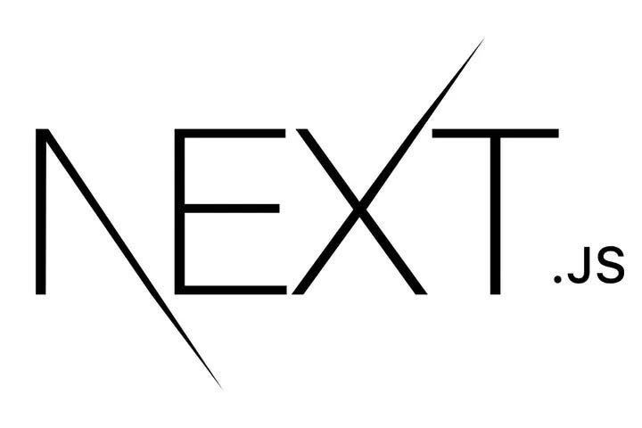

## Introduction

When I originally signed up for ICS 414, I was very excited. I knew that by that point, I would have over a years experience in web application development, with a few months of that being in a professional environment. I was also excited to be able to work with peers again, as I had a really great experience in ICS 314 with friends that I still am close with to this day. However, once I was a couple weeks into the semester, all of my excitement had faded. Nothing was what I expected, and I quickly lost any and all interest in putting in more effort than was necessary

## August and September

The first day of class began without much of a hitch. I met my teammates, who all seemed pretty nice, and we set up a discord to communicate and the beginnings of our GitHub organization. However, it didn't take long for things to begin falling apart. One of our members never joined the discord. He had also been completely non-communicative over text. Upon checking the laulima roster, I found that he had dropped the class without ever letting anyone know that he was.

When I broke the news to the group, we were all frustrated. Not even two weeks into the semester, we were already down a member. Nevertheless, we decided to just keep on pushing forward. Initially, I brought up the idea of potentially using Next.js instead of Meteor. I thought that this would be beneficial for a few reasons. For one, we had already done a project using Meteor. On our resumes, having 2 Meteor projects when it is essentially a dead framework would be pretty redundant. It would have also been a great learning experience as it is likely the most popular web framework and we could get experience deploying on Vercel.

My group was initially receptive, but they quickly ran into issues. One member couldn't figure out how to get it running, so I wrote a comprehensive quickstart guide. Another was confused about how the router worked, so I sent resources that explained them.

However, it was all for naught. About a week or two after starting with Next, the group came together and decided that we would be swapping back to Meteor. To this point, I had been spending much more time than I was required to on the project. This was the beginning of me scaling back my involvement to a more reasonable level.

## October to November

At this point, my real life was beginning to take over my school life a bit. I had a remote internship that I continued over the summer, and deadlines began to come up quick. CDR was fast approaching, which made it hard to be concerned about a project that would have little to no impact on my resume. I continued to do my fair share of contribution, but quickly found that several of my groupmates weren't.

It was here that I came to a crossroads. Do I put in an exorbitant amount of effort to create a satisfactory product? Or do I continue to do what 1/7th of the work should look like and let the group fail.

I decided to choose the latter.

When customer meetings came up, I had to do the presentations, as my group members either didn't come to the meetings or were unable to access their computers during the time period. I pushed huge updates prior to these meetings that feigned productivity for the entire group rather than just myself.

By November, I was completely burnt out of the project. I was done. 3 members of the group had never committed to the repository at this point, and I knew that it was over.

## Burnout

I experienced my first real taste of burnout at this point in the semester. Work, research, and school all piled on top of one another and made everything difficult.

It was here where I began to falter. I didn't do some reviews, didn't make some commits. I felt like I had done much of my piece, and decided to pour myself into my other classes and my actual job.

Was this the right decision? I'm not sure. However, it got me through the burnout phase, so it worked good enough for me.

## December

In the last month of the project, I decided to pour a bit more time into it. I rewrote the graph code, which took a lot of work, and was ready to see what everyone else did for the final stretch.

Spoiler: nobody pushed anything significant. It was a fitting end to a disappointing semester. By the end of class time, 2 people had still never committed to our main repository over the course of the entire semester. Several commits were changing the text from uppercase to lowercase or modifying comments. 

However, I found a lot of peace in knowing that it was not my issue anymore. I have a job to look forward to with capable team members, and am ready to just get the semester over with.

## Conclusion

Overall, I wouldn't say that this class was a great experience. However, I do believe that it was a valuable one. It was good to know how a situation like this felt and how I could possibly react to it in the future. Although I do wish that I could do it over again with a more productive group, I am thankful for the opportunity that was provided to me.