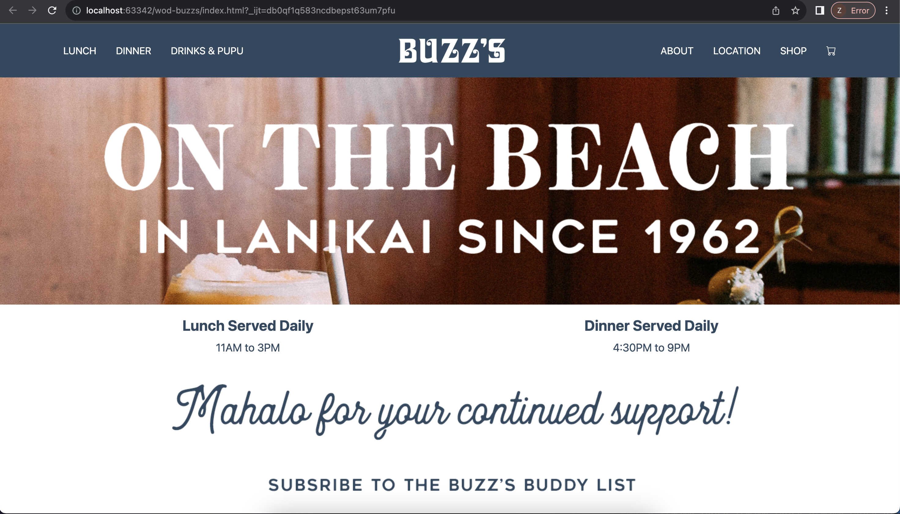

## Introduction

When I entered into the HTML and CSS section of this class, I was definitely apprehensive. I have played around with both languages a little, but have never done anything nearly as extensive as ICS 314 required. So as I looked through the screencasts and completed the practice WODs, I felt pretty good about it. The simple websites were not hard at all, and the basic formatting was actually almost relaxing to debug and fix. When I looked at the Island Snow WOD, which required that we copy a much more complicated website, I felt a sense of dread - and I was right!

## Complex Websites and Problems That Come With Them

When looking at a website with a ton of design elements, it's hard to believe that it is all technically constructed from HTML and CSS. This is why frameworks are so helpful - when used correctly, they are a massive shortcut to creating a visually pleasing website.

There's just one problem. I strongly disliked Bootstrap.

I'm not particularly sure why. Maybe it was the massive amount of class tags that was pretty overwhelming at first. Or perhaps it was just the frustration of things just not working like how I felt like they should. Either way, I did not have a good time. When doing the "your choice" assignment, where we were tasked with creating a clone of a website we found online, I found myself just getting frustrated with how the page elements just didn't seem to work with one another.

## The Positives

Although I may have ended up not liking the process of working with Bootstrap, I do not deny that trying to do all of that without it would have been an absolutely terrible experience. I cannot imagine how long it would have taken to come up with all of the CSS myself just to be able to create something presentable. 

Bootstrap is the only HTML framework that I've really worked with, and I don't find myself rushing to try another one. This is primarily because I don't think that my issue is with Bootstrap in particular, but with web design as a whole. At the current time, I just really am not a huge fan of how you can get so stuck without a single error message showing up.

## Conclusion

In conclusion, web design is not my passion. Hopefully, I like being able to do work with React and Meteor better, because I did enjoy working with JavaScript. Hopefully I begin to enjoy the creative process that working with UI frameworks offer as I work with them more and more.