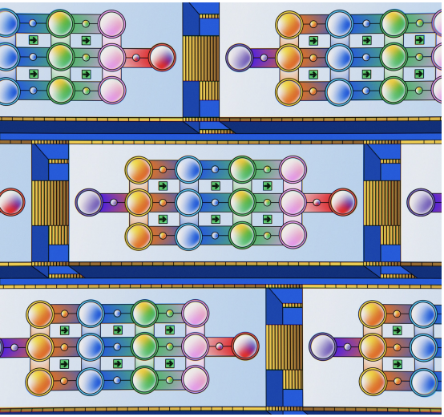

## Overview
Model in the Mirror was a research project I completed with the Center for Language and Technology at UH Manoa under a Undergraduate Research Opportunity Program (UROP) grant. The purpose was to develop a script that creates "C-tests," which are language learning passages that the Center will use for an app that they are developing. I had an advisor to assist me with project direction, but all code was written by me.

## Procedure
The script does the following:
1. Takes a text sample from most text formats (txt, pdf, epub, etc).
2. Inputs this text into OpenAI's ChatCompletion API with a prompt asking the model to generate 5 new passages from the base text.
3. Places the output into a list for processing.
4. Queries the model again and modifies the passage to a difficulty level and language the user inputs.
5. Queries the model to categorize the passage from a list of single-word topics.
6. Places the passage into a .json database for long-term storage.
7. Uses spaCy NLP to separate the passage into sentences, and then tokens.
8. Surrounds the second half of every second word with astrixes, excluding the first sentence, proper nouns, numbers, and punctuation (as punctuation is a token).
9. Recombines the tokens into a string and sends the output to another .json file.

## Lessons
In the process of developing this script, I developed a wide range of useful skills. I learned about the intricacies of type conversion, string manipulation, managing Python libraries, github file management, language processing, and more that would turn this sentence into a massive run-on. I also learned a lot about linguistics and the way by which spaCy processes and analyzes the text. The experience I gained by developing a project like this was invaluable and I can't wait to continue working on it over the course of this semester.

## Links and Viewing Guide
[This](https://github.com/llcit/model-mirror "llcit/model-mirror") is a link to the repository where all files are stored. The current main prompt generator is stored in the "generators" folder under newgenerator.py. There is also a file called pipeline.py that generates a C-test from a random passage within a database. spacyfunctions.py is where the actual C-test conversion takes place. The last main file to highlight is doc_thoughts.ipnyb, which is a Jupyter notebook documenting the production of the project. Additionally, [this](https://hushed-spiny-scaffold.glitch.me "H5P example") is a sample website that was used for language experts to test the C-tests.
