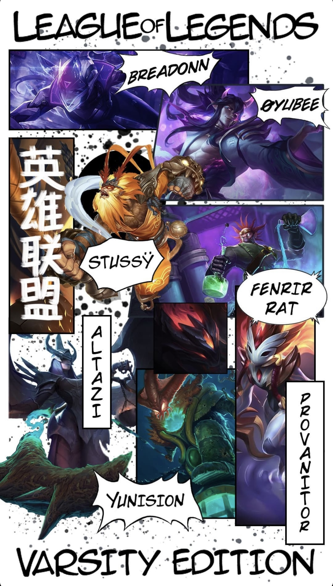
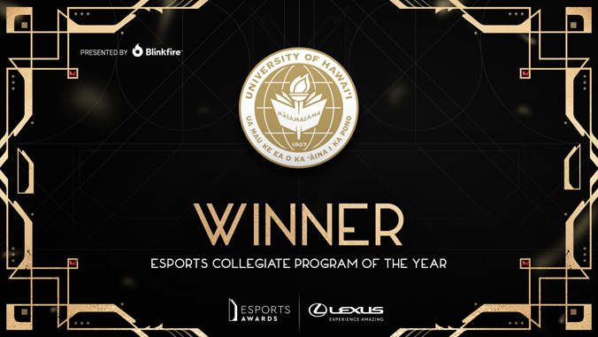
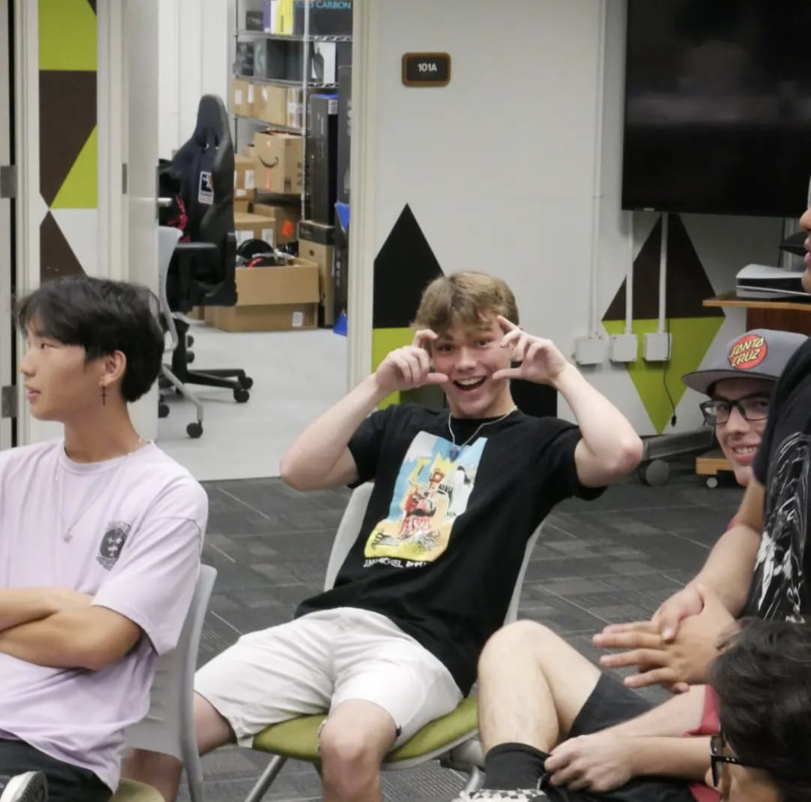

## Player
From Fall 2021 to now, I have been either a player or coach for the University of Hawaii's eSports team, which was ranked as the best collegiate eSports program at the eSports awards last year. In 2021, my freshman year, I played on the "Varsity" League of Legends team, which was made up of players that ranked in the top 0.1% in North America. We played in a national collegiate circuit called CLOL.

## Coach
The next semester, I was pretty burnt out and decided to swap over to coaching a lower-ranked team. I ran tryouts, picked a group of players that I thought would mesh well together, handled scouting and practices, and helped to strategize on game days. That team made playoffs.

## Other Roles
The next year, I fulfilled multiple different roles for the program. Although I played the game much less, I was still close with many of the members of the team. I just decided to help where I could. Overall, the eSports program helped me continue what I started in high school (I founded the club there that is actually still going). I further developed my leadership skills and learned how to be on a team with people I would eventually grow to be incredibly close with.

## Photos
 
